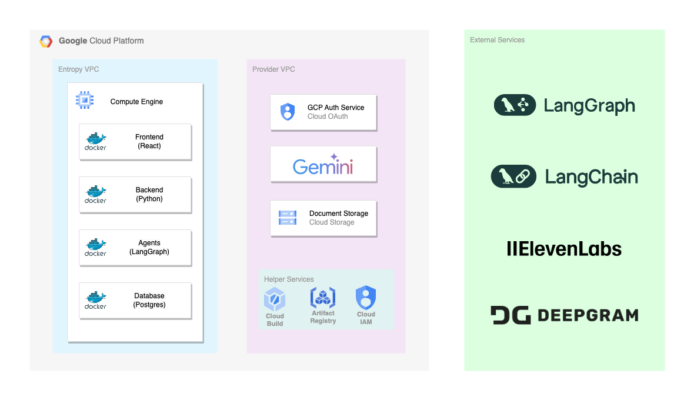

# CliniQ360 - Entropy

**Tech Stack**

- **Frontend:** React
- **Backend:** Python
- **AI Engine:** Vertex AI - Gemini
- **Agentic Framework:** LangGraph

## Architecture Diagram
The following diagram illustrates the architecture of the MIQ&A Bot:




## Deployment Steps

To run the application, follow these steps:

1. **Clone the repository:**

   ```sh
   git clone <git_repo_path>
   ```

2. **Populate the env_var file**


3. **Build containers**
   ```
   sh build_all.sh
   ```
4. **Frontend will be up on port 4000 and backend APIs on port 8000**